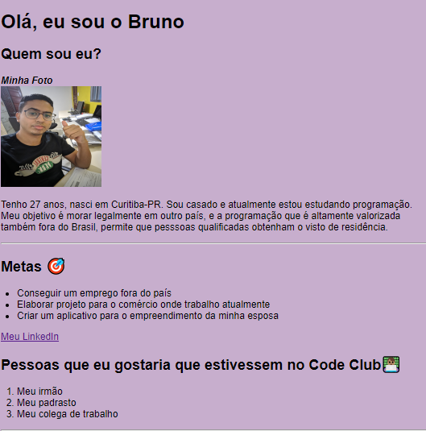

# First-html
  
Resultado do primeiro projeto!

### Ajustes e melhorias

O projeto ainda está em desenvolvimento e as próximas atualizações serão voltadas nas seguintes tarefas:

- [x] Tarefa 1 - Write a first code with html.
- [x] Tarefa 2 - Set a personal photo.
- [x] Tarefa 3 - Creat list
- [ ] Tarefa 4 - Add a css to change the colors.

Como alternativa, consulte a documentação do GitHub em [como criar uma solicitação pull](https://help.github.com/en/github/collaborating-with-issues-and-pull-requests/creating-a-pull-request).

## 🤝 Colaboradores

Agradecemos às seguintes pessoas que contribuíram para este projeto:

<table>
  <tr>
    <td align="center">
      <a href="https://www.linkedin.com/feed/">
         
        
          <b>Alex Bruno</b>
        
      </a>
    
</table>

[⬆ Voltar ao topo](#nome-do-projeto) 
